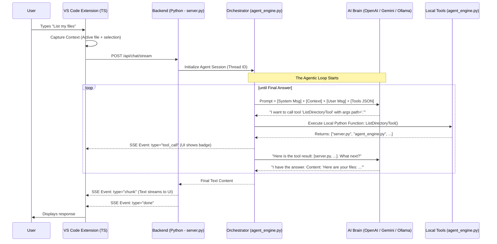

# Navyug AI Architecture & Data Flow

This document provides a complete technical map of how a message travels from your screen into the AI and back.

## 1. High-Level Diagram
This diagram shows the "Loop" between the Frontend, Backend, LangGraph (Orchestrator), and the LLM.

## 2. Who is Responsible for What?

### A. The "Navyug AI" Name
- **Navyug AI** is the name of **your project**.
- It is NOT an imported library (like `import openclaw`).
- It is the **orchestration logic** you have in your folders.

### B. The Orchestrator: LangGraph 🧩
- **Role**: The "Manager" of the loop.
- **Source**: Imported via `from langgraph.prebuilt import create_react_agent`.
- **How it works**: It sends the tool list to the LLM and handles the execution logic. If the LLM says "call Tool X", LangGraph finds Tool X in your Python code and runs it.

### C. The Tool Provider: Local Python Functions 🛠️
- **Role**: Actually doing the work (reading files, running shell).
- **Source**: Defined in `backend/agent_engine.py`.
- **Relationship**: These functions are decorated with `@lc_tool` (LangChain Tool). This decorator formats the function's docstring into a JSON schema that the LLM can understand.

### D. The Backend: FastAPI ⚡
- **Role**: The "Courier".
- **File**: `backend/server.py`.
- **Responsibility**: Listens for HTTP requests from VS Code, passes messages to the Agent, and streams the AI's thoughts back to the UI.

### E. The Frontend: VS Code Extension 🖥️
- **Role**: The "UI & Context".
- **File**: `frontend/src/chatViewProvider.ts`.
- **Responsibility**: Captures the code you are looking at, sends it to the backend, and renders the chat bubbles and tool badges.

## 3. The "Tool Calling" Chain
1. **LLM** decides: "I need to run a command."
2. **LangGraph** sees the request and calls the `terminal()` function in your `agent_engine.py`.
3. **Your Python Code** runs `subprocess.run()` to execute the command on your machine.
4. **LangGraph** sends the output back to the **LLM**.
5. **LLM** reads the output and writes the final response to the user.
